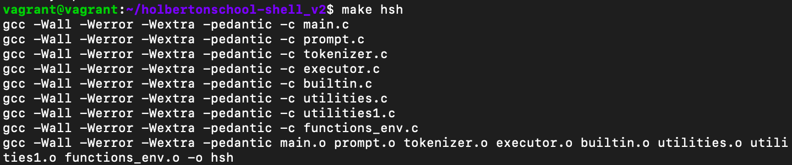

<h1 align="center">Holberton School - Simple Shell_v2:</h1>

## Table of contents

- [Overview](#description)
- [Features](#features)
- [Example Usage](#example-of-use)
- [Authors](#authors)
- [License](#license)
- [Man-page](#man-page)

### Description
`shell` is a UNIX command interpreter that replicates core functionalities of the `sh` shell. Through this project we recoded shell as exercise of Holberton School.


## Installation and Compilation

### To get this project up and running locally on your computer:

1) Clone the repository with the code:

```
git clone https://github.com/guenoel/holbertonschool-shell_v2.git
```

2) Then to compile you can use one of these two methods.

```
gcc -Wall -Werror -Wextra -pedantic *.c -o hsh
```
```
make hsh
```

### Usage
* The usage of this program is exactly like `sh`. The shell can run in either interactive or non-interactive mode.
* Compile the code by the command 'make hsh', and you launch this program by './hsh'.
* Function returns with the specified exit status.


### Features
The shell handles command line input, including arguements.
In addition to running executables in the PATH, the following features are currently implemented.
This program is coded under the restriction that only the following standard library functions are allowed to be used.
The allowed functions:

`access`, `chdir`, `close`, `execve`, `fork`, `stat (__xstat)`, `lstat (__lxstat)`, `fstat (__fxstat)`, `kill`,
`open`, `read`, `signal`, `wait`, `waitpid`, `wait3`, `wait4`, `write`, `_exit`, `dup`, `dup2`, `pipe`, `unlink`, `time`,
`gethostname`, `geteuid`, `sigaction`, `sigemptyset`, `select`, `getpid`, `__errno_location (errno macros)`,
`closedir`, `exit`, `free`, `getcwd`, `getline`, `malloc`, `opendir`, `perror`, `readdir`, `strtok`, `localtime`,
`getpwuid`, `isatty`, `printf`, `fflush`, `fprintf`, `vfprintf`, `sprintf`


|  Builtin Commands  |    Functionality                            |
| ------------------ | ------------------------------------------- |
| `exit`             | Exit shell				   |
| `env`              | Print list of current environment variables |
| `setenv`           | Set an environment variable                 |
| `unsetenv`         | Unset an environment variable               |
| `cd`               | Change directories                          |

|  Handle  Redirections    |    Functionality                            |
| ------------------ | ------------------------------------------- |
| `<`		     | Redirect input		          	   |
| `>`		     | Redirect output				   |
| `<<`		     | Append input (heredoc)			   |
| `>>`		     | Append output				   |


|  Handle  Separator    |    Functionality                            |
| ------------------ | ------------------------------------------- |
| `;`		     | The commands separator		          	   |


|  Handle  Operator      |    Functionality                            |
| ------------------ | ------------------------------------------- |
| `&&`		     |  The logical operator		          	   |
| `\|\|`		     |  The logical operator		          	   |


### Example of use
* This shell takes input the same as a standard unix shell.  After running the executable `hsh`, enter desired input and press return.
* `ls -l`
* `exit`
* `cd -`
<br>
Example:


You can also redirect:


### Man-Page

* [man-page](./man_1_hsh.1)


### Authors
* Jose Fernandez Armas [Github](https://github.com/crasride) - [Twitter](https://twitter.com/JosFern35900656)
* Guenoel Andrieux [Github](https://github.com/guenoel)
* Anna Takasu [Github](https://github.com/graefft) - [Twitter](https://twitter.com/KinuwaReeves?ref_src=twsrc%5Etfw)

## License
This is open-source, free to download and use without permissions.
